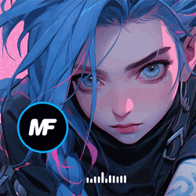

### Hey ，I'm JiaQuan Yi

---

-  

 

Hi, I'm JiaQuan Yi 😉, a programmer 👨🏻‍💻 from China 🇨🇳. Beside's programming, I like delicious food 🥗🥩🌮🍣 and playing table tennis 🏓.

---

### 🏊 Current Status Quo

- 👨🏻‍💻 I’m currently working on [mindspore](https://gitee.com/mindspore/mindspore)/[mindformers](https://gitee.com/mindspore/mindformers)。
- 🌱 I’m currently learning c、c++、java、python。
- 💻 I love writing code and learn anythings about it
- 💬 Ask me about anything, I would like to answer.

---

### 🧰 Language Tools

**Languages and Frameworks**

<code></code>
<code></code>
<code></code>
<code></code>
<code></code>
<code></code>
<code></code>
<code></code>
<code></code>

**Tools and Environments**

<code></code>
<code></code>
<code></code>
<code></code>
<code></code>
<code></code>
 

**Design**

<code></code>
<code></code>
<code></code>
<code></code>

---

### 🏆 My Github Stats

点击展开 ...

---
### 📝 Latest Blog Posts
<!-- BLOG-POST-LIST:START -->
<!-- BLOG-POST-LIST:END -->

点击展开 ...

<!-- BLOG-POST-LIST:START -->
- 🐻 [Spring AI 初识](https://yijiaquan.github.io/docs/#/AI/Spring_AI_%E5%88%9D%E8%AF%86) 
<!-- BLOG-POST-LIST:END -->

更多内容请关注：[coding学习博客](https://yijiaquan.github.io/docs)

